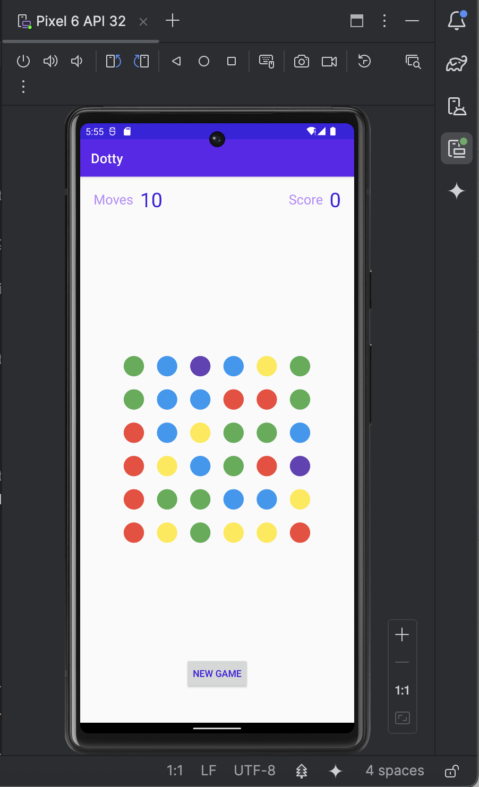
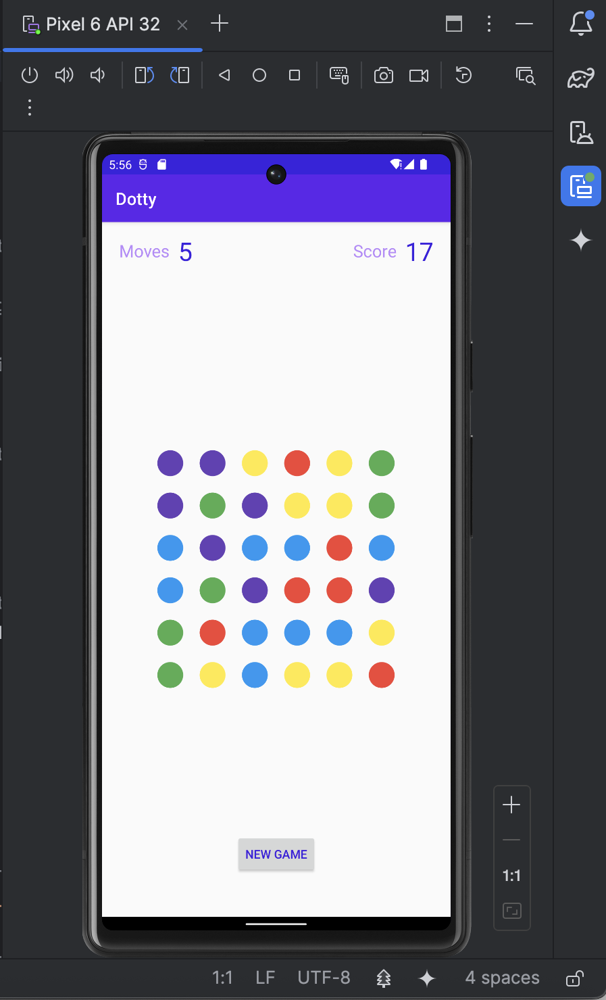
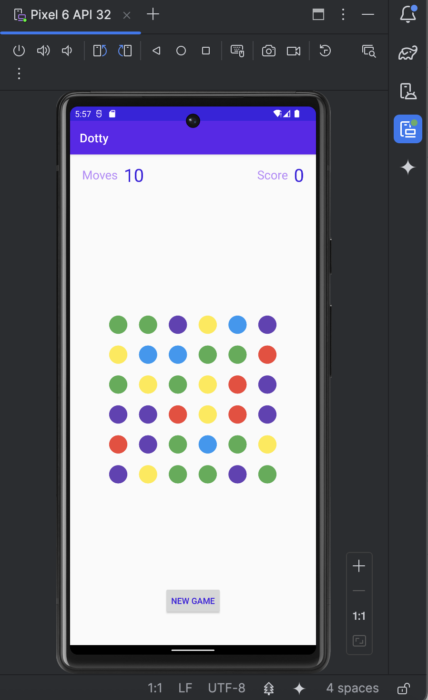

# 🎮 Dotty — Color Matching Puzzle Game

**Dotty** is a simple, fast-paced Android puzzle game where the player connects adjacent dots of the same color to earn points.  
A valid move removes the connected dots, shifts the remaining ones downward, and refills the board with new dots.  

Players get **10 moves per game**, and the interface includes smooth animations and fun sound effects every time a dot is selected or a game ends.

---

## ✨ Features

- 🎨 **6×6 colorful dot grid**  
- 🔗 **Connect adjacent matching dots** to clear them  
- 🧮 **Automatic scoring** based on number of dots selected  
- ⬇️ **Gravity effect** — dots fall to fill empty spaces  
- 🆕 **New Game button** to restart anytime  
- 🔊 **Sound effects** for selection, removal, and game-over  
- 🎬 **Animations** for disappearing and falling dots  
- 📉 **Move counter** — game ends after 10 moves  
- 📱 Single-screen, clean UI

---

## 🖼️ Screenshots

### **1. Game board on first load**

### **2. Game after 5 moves**

### **3. Game completed — all moves used (win sound plays)**

### **4. After pressing NEW GAME**

---

## 🧠 Game Logic Overview

Dotty uses a clean separation of concerns between:

### **🔹 Dot.kt**  
Represents a single dot on the board.  
Stores:
- position (row, col)  
- color  
- drawing coordinates  
- radius  
- selection state  
Includes adjacency logic for matching moves.

### **🔹 DotsGame.kt (Core Game Engine)**  
Handles:
- grid creation  
- selection chain rules  
- validating moves  
- removing dots  
- scoring  
- gravity-based falling  
- generating new random dots  
- tracking moves left  
Implements **Singleton pattern**.

### **🔹 DotsView.kt (Custom Drawing + Touch Input)**  
Responsible for:
- drawing circles  
- animating disappearing dots  
- animating falling dots  
- drawing selection lines  
- handling touch gestures  
- callback interface to MainActivity  

### **🔹 MainActivity.kt**  
Handles:
- UI text updates  
- starting a new game  
- listening to dot selection events  
- triggering animations  
- playing sounds  
- updating score and move counter  

### **🔹 SoundEffects.kt**  
Uses **SoundPool** to play:
- tone sequence when selecting dots  
- tones when backtracking  
- victory/game-over sound  

---

## ▶️ How to Play

1. Tap or drag to connect **adjacent dots of the same color**.  
2. Release your finger to clear them.  
3. Dots fall down and score increases.  
4. You have **10 total moves**.  
5. Press **NEW GAME** to restart anytime.

---

## 📦 Technologies Used

- Kotlin  
- Custom View drawing (Canvas, Paint, Path)  
- Animations (ValueAnimator, AnimatorSet, ObjectAnimator)  
- SoundPool  
- Singleton game engine pattern  
- Touch input handling  

---
